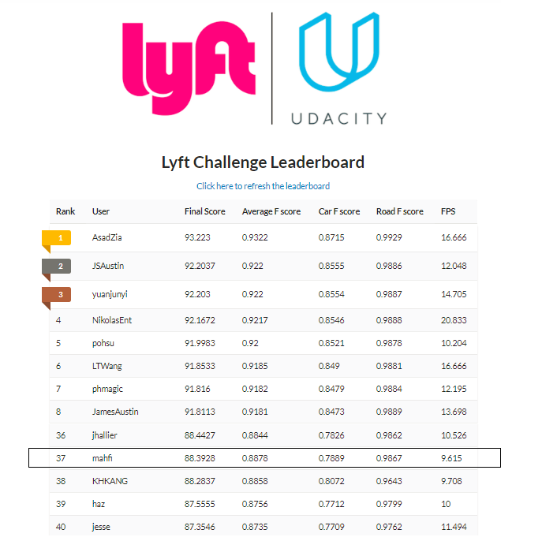

# Lyft Perception Challange 2018 (My Approach)

From May 1, 2018 to June 3, 2018 Lyft arranged a percention challange for Udacity self driving nano-degree current and formar students. Participents were encoursed to apply computer vision and deep learning based approach to solve the given problem. As a student of Term 2 of Self driving nano-degree program of Udacity, I participated in the challange and placed 37th position globally.  As a newbi in deep learning, I had zero knowledge about image segmentaiton. But after a month long hard work, I was able to pull off a decent result. In this document, I am going to describe my approach to the problem.

## Leader Board

## Challenge Overview
The goal in this challenge is pixel-wise identification of objects in camera images. In other words, the task is to identify exactly what is in each pixel of an image! More specifically, you need to identify cars and the drivable area of the road. The images below are a simulated camera image on the left and a label image on the right, where each different type of object in the image corresponds to a different color.

    
    <em>Example of a simulated camera image (left) and pixel-wise labels of cars, road, lane markings, pedestrians, etc. (right) </em>

