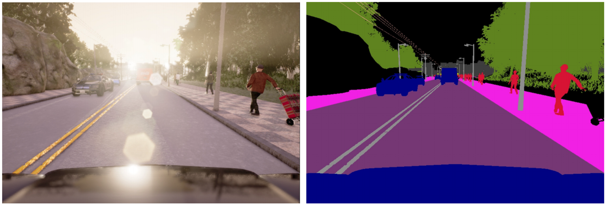

# Lyft Perception Challange 2018 (My Approach)

From May 1, 2018 to June 3, 2018 Lyft arranged a percention challange for Udacity self driving nano-degree current and formar students. Participents were encoursed to apply computer vision and deep learning based approach to solve the given problem. As a student of Term 2 of Self driving nano-degree program of Udacity, I participated in the challange and placed 37th position globally.  As a newbi in deep learning, I had zero knowledge about image segmentaiton. But after a month long hard work, I was able to pull off a decent result. In this document, I am going to describe my approach to the problem.

## Leader Board


## Challenge Overview
The goal in this challenge is pixel-wise identification of objects in camera images. In other words, the task is to identify exactly what is in each pixel of an image! More specifically, you need to identify cars and the drivable area of the road. The images below are a simulated camera image on the left and a label image on the right, where each different type of object in the image corresponds to a different color.
<p>
    
    <em>Example of a simulated camera image (left) and pixel-wise labels of cars, road, lane markings, pedestrians, etc. (right) </em>
</p>

## Dataset

The given dataset by lyft contained 1000 images containing road and cars along with ground truth (segmented image) from CARLA autonomous vehicle simulator. Two students of Udacity gracefully donated more 2000 dataset. I used that dataset in training my model.

## Model Selection

First I implemented the SegNet Architecture. But my model as not performing well and was giving a very low framerate and accuracy. I tried data augmentation, dropout, and regularization on SegNet. But still model was performing poorly. Then I realized that the model was too complicated and selected Fully Convolution Network (FCN) [Long et al.](https://people.eecs.berkeley.edu/~jonlong/long_shelhamer_fcn.pdf) as it is simpler model. I modified VGG16 pertained model to segment the cars and road using FCN-8 for this competition. I selected FCN-8 as it provides better accuracy compared to FCN-16 and FCN-32. I modified the output layers for 3 classes so that it predicts Cars, Roads, and None for rest of the classes. My model takes input (352, 800, 3) as the input image and outputs an image with the same size. As the submission time was extended I got more time to work on improving my model. I reduced the input image size and go a better fps around 9.34. Currently my model takes input (288, 544, 3) as input and later resized the output to fit into (600,800,3).

## Data Prepossing

The given ground dataset contained 12 classes and need to reduce it to 3 classes (Cars, Roads, and None). I used the following code to preprocess the ground truth data from Red channel of the ground truth image. 

```
background_color = np.array([0, 0, 0])
car_color = np.array([0, 0, 10])
road_color = np.array([0, 0, 7])
road_color1 = np.array([0, 0, 6])

gt_bg = np.all(gt_image == background_color, axis=2)
gt_bg = gt_bg.reshape(*gt_bg.shape, 1)
gt_sr = np.all(gt_image == car_color, axis=2)
gt_sr = gt_sr.reshape(*gt_sr.shape, 1)
gt_r = np.all(gt_image == road_color, axis=2)
gt_r = gt_r.reshape(*gt_r.shape, 1)
gt_r1 = np.all(gt_image == road_color1, axis=2)
gt_r1 = gt_r1.reshape(*gt_r1.shape, 1)
gt_r |= gt_r1

for c in range(13):
    if (c==6 or c== 7 or c==10):
        continue
    bg = np.array([0, 0, c])
    gt_bg_c = np.all(gt_image == bg, axis=2)
    gt_bg_c = gt_bg_c.reshape(*gt_bg_c.shape, 1)
    gt_bg |= gt_bg_c

gt_image = np.concatenate((gt_bg, gt_r, gt_sr), axis=2)
```

The top and bottom part of the image was not necessary and was confusing the model prediction. So I removed top 248 pixels from the input and ground truth images. I also removed the bottom hood part from the ground truth images to have better accuracy on grading. Furtheremore, the hood was classified as Car, which I removed it in ```bottom_crop``` function as follows:
```
def top_crop(x1):
    h , w , _ = x1.shape
    top_crop = 352
    x2 = x1[(h-top_crop):h,0:w,:]
    return x2

def bottom_crop(x1):
    h , w , _ = x1.shape
    offset = 110

    idx , idy = np.where(x1[h-offset:h,0:w,2] == 10)
    x1[idx+(h-offset),idy,:] = 0 
    
    offset = 64
    x2 = x1[0:(h-offset),0:w,:] 
    
    return x2
 ```   
... coming soon ...

## Data Augmentation

I used 3 data augmentation techniques to create more data. I used adding rain, snow and changed the brightness and contrast of the input images. That made the total data size of 3000+ (3000*3) = 12000 images.

## Framerate Improvement

Initially, my model was performing well with 87.5% average F score. But the framerate was very low ~1 fps. Then I changed my segmentation to feed multiple images for the prediction. That improved the framerate to ~5fps. Later I found that the fps can be improved by reducing the model to a smaller input image size. Following results I got to check the dependency of framerate on input size: 

| Input Size       | Tester F-Score           | Framerate  |
| ------------- |:-------------:| -----:|
| 252x800x3     | 89.5 | 8.33 |
| 252x384x3      | 87.5      |   13.33 |
| 288x544x3 | 88.8      |    9.345 |

After checking I selected the input size 288x544 for my model, as I produce a decent F-score and framerate close to 10.
I also did coding optimization on the prediction pipeline as suggested by one of the Udacity Students: 1) Batch Prediction, 2) using different ``encode`` function. 

## Lesson Learnt and Further Improvement

It was a fun project for me to learn new stuff in deep learning. But I wish I would know and use following techniques to get a better score in the competition:

1. Use better augmentation techniques like roatation, flipping, Noise addition etc, Toppers in this competition used these techniques to improve their socre. 

2. Use TensorRT for the netwrok optimization and faster prediction. 

3. Use Carla software to produce more data for training. I only used the total 3000 images given by Lyft and Students. 

4. Use Tensorboard the get more inside knowledge the model.

### Personal Note

I just have finished my Term 1 in Udacity self-driving Nano-degree program and have a little experience in deep learning. When I see the Lyft challenge, I wanted to participate only to learn. Before the challenge, I had zero knowledge about image segmentation. I worked with Keras before but wanted to learn tensor flow. So, I took it as a challenge to push myself to learn tensorflow and improve my python efficiency. First, I started to read papers and study existing implementation of image segmentation and it was fascinating to me learning how image segmentation works. I worked hard and was able to produce a decent output by detecting cars and roads. The bottleneck of my implementation was low framerate, and I wish I knew about ‘tensorrt’ and optimization of neural networks before the competition. Though I was not in top 25, I feel happy that I have learned so much during this competition. And I wish to work in Lyft in Level 5 Autonomous vehicle team one day.  Happy Coding!!!

## Acknowledgements

... coming soon ...

